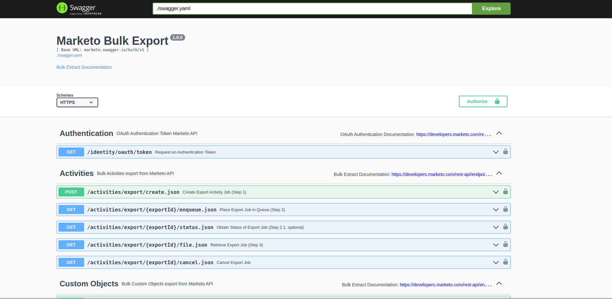

# MARKETO BULK EXTRACTION API

## INSTRUCTIONS TO BEGIN REST CALLS

# AUTOMATED BULK DOWNLOAD INSTRUCTIONS

1. Install python and pip3
2. Open a command line or terminal
3. Go to the marketo/automate directory
4. Run "pip3 install -r requirements.txt"
5. Run "python3 automate.py"

### API POSTMAN SETUP INSTRUCTIONS
1. Download this project as a ZIP file and extract the files
2. Install [Postman](https://www.postman.com/downloads/)
3. Create a free Postman account
4. Open Postman App
5. Click "Import" on top right side
6. Browse to "marketo-main/swagger-ui-client_side/dist" folder
7. Select the "swagger-mapi-export.json" file
8. Click the orange "Import" button

"Marketo Rest API" should show up on the left. The API is ready for usage

### POSTMAN USAGE INSTRUCTIONS
1. Expand the tree next to "Marketo Rest API" until you see "Request an Authentication Token"
2. Click "Request an Authentication Token"
3. Paste your client_id and client_secret in their respective boxes
4. Click the blue "Send" button on the top right
5. Record the access_token when the Rest call is complete. This will be below the box you just edited in an area entitled "Response"
6. Expand the "leads" and subsequent "export" trees
7. Click "Create Export Lead Job"
8. Paste the access_token from step 5 into the respective box (under the Params tab)
9. Click the "Body" tab
10. Remove any fields you don't want, or just leave it as-is
11. Change the "endAt" and "startAt" fields to desired timeframe --> format as YYYY-MM-DDThh:mm:ssTZD (ISO 8601 format). **THE TWO DATES MUST BE WITHIN 30 DAYS OF EACH OTHER**
12. Remove the "smartListId", "smartListName", and "updatedAt" fields
13. Remove the "columnHeaderNames" section
14. Click the blue "Send" button on the top right
15. Record the export_id when the Rest call is complete
16. Expand the "{export_id}" tree
17. Click "Enqueue Export Lead Job"
18. Paste the access_token and export_id in their respective boxes
19. Click the blue "Send" button on the top right
20. *Optional* Click "Get Export Lead Job Status"
21. *Optional* Repeat steps 17-19
22. *Optional* Check the "Response" section to see if the job is complete
23. Click "Get Export Lead File"
24. Repeat steps 17-19

If there were no errors, the file should be downloading to your computer

## ~~INSTRUCTIONS TO START SERVER~~ Ignore this section unless testing locally

1. Run 'cd marketo/swagger-ui-master'
2. Run 'npm install'
3. Run 'npm start'
4. Open a browser
5. Go to [The API Page](http://localhost:3002/)
6. Execute required REST calls
### OPEN SWAGGER UI IN BROWSER
1. **Authentication**
    - a. Click "Try it out" button
    - b. Copy client_id and paste inside quotes next to client_id field (replace the word "string")
    - c. Copy client_secret and paste inside quotes next to client_secret field (replace the word "string")
    - d. Click "Execute" button
2. **Create Job**
    - a. Select a category (Activities, Custom Objects, Leads, or Program Members)
    - b. Click the "/bulk/v1/{category}/export/create.json" section - it will say "Create Export (category) Job - Step 1" to the right
    - c. Click "Try it out" button
    - d. Remove the "columnHeaderNames" bracket
    - e. Remove "string" from inside the "fields" bracket
    - f. Remove all filters except "createdAt" (if applicable, required for most calls)
    - g. Input an ISO-formatted date inside "endAt" and "startAt" fields - ISO Date Format is YYYY-MM-DD
    - h. Change the word 'string' to 'CSV' next to the "format" field
    - i. Click "Execute" button
    - j. Record/Copy the "exportId" that was received in the "Responses" section
3. **Retrieve Job**
    - a. Click the "/bulk/v1/{category}/export/{exportId}/enqueue.json" section - it will say "Enqueue Export (category) Job - Step 2" to the right
    - b. Click "Try it out" button
    - c. Paste the exportId from step 2.j into the text box
    - d. Click "Execute" button
    - e. *(OPTIONAL)* repeat steps a-d in the "/bulk/v1/{category}/export/{exportId}/status.json" section to see if the job has been completed
    - f. When job is completed, repeat steps a-d in the "/bulk/v1/{category}/export/{exportId}/file.json" section. The CSV file should automatically download to your computer.

# marketo-api
